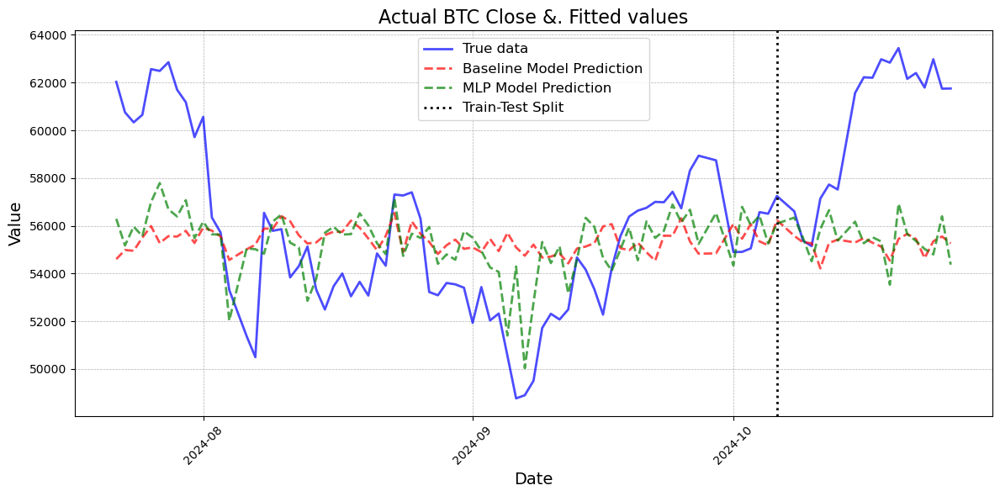

# Social Speculation for Harnessing Reddit to Forecast Bitcoin Fluctuations

### Introduction
Predicting the price of Bitcoin (BTC) remains a challenging task due to the highly volatile and sentiment-driven nature of the cryptocurrency market. In this project, I explored the use of sentiment analysis on Reddit comments as an indicator of public opinion and potential price movements. Starting with a baseline model that directly mapped the input features to the BTC closing price, I progressively enhanced the model by introducing a more complex neural network structure. Through trial and observation, I identified limitations in a single-layered approach and iteratively improved the model using a multi-layer perceptron (MLP) with dropout regularization to mitigate overfitting. The aim was to create a model that not only captures short-term fluctuations in BTC price but also generalizes well to unseen data. This report outlines the evolution of the model from a simple regression to a refined two-layered MLP, detailing the rationale behind each enhancement and areas for further improvement.

### 1. Baseline Model Logic
The baseline model in this study serves as a foundational benchmark to evaluate more sophisticated approaches. Initially, I employed a closed form solution regression model that maps sentiment scores as well as other comments related inputs derived from Reddit comments to predict the closing price of Bitcoin. This baseline approach uses only a single layer of neurons to draw a direct correlation between input sentiment features and output prices.The model assumes that public sentiment has a direct and immediate effect on Bitcoin’s closing price, disregarding the time dependency between data points. Although this model provides a basic structure, it is limited in its ability to capture the intricacies and underlying patterns in financial data, which often exhibit both complex interactions and temporal dependencies.

### 2. Transition to a Two-Layered MLP with Dropout Regularization
Upon implementing a one-layered MLP (Multi-Layer Perceptron), I quickly observed that the model's complexity was insufficient to capture meaningful patterns in the data. While the model could learn simple relationships, it struggled to capture more nuanced interactions, resulting in a significant underfitting issue. In response, I experimented with increasing the number of neurons within the single layer to enhance model complexity. However, this approach led to overfitting, where the model memorized the training data and failed to generalize effectively to the test set. Given the limited sample size and the model’s tendency to overfit with a single dense layer, I decided to introduce a second hidden layer. This two-layer structure allowed the model to build a hierarchical representation of sentiment features, providing a more balanced complexity.

To address overfitting further, I integrated dropout regularization between the hidden layers. Dropout mitigates overfitting by randomly deactivating a fraction of neurons during training, ensuring that the model does not become overly reliant on any specific neurons. Through extensive fine-tuning of both the network structure and the dropout rate, I achieved a model that demonstrated satisfactory performance, successfully capturing patterns in the data without overfitting. This two-layered MLP with dropout offered a balanced complexity, capable of modeling subtle relationships between sentiment and price fluctuations.

### 3. Model Limitations: Challenges in Capturing Trends
While the final model captured general fluctuations in Bitcoin’s closing price, it failed to predict the upward trends in the test set (the last 20% data points) accurately. This limitation arises from the model’s inherent design, as it treats each data point independently, disregarding time dependency. In time series data, especially in financial contexts, the past often informs future trends, meaning that the historical trajectory plays a significant role in current behavior. By using only comment related indicators for each time step as input features, without accounting for previous values or trends, the model lacked context, making it less effective at capturing longer-term trends. As a result, while the model could track short-term fluctuations, the lack of sequential awareness restricted its ability to capture the broader directional movements in the price.

### 4. Potential Improvements: Leveraging CNN for Time-Series Analysis
To improve the model’s ability to capture time-dependent patterns, I could explore using a Convolutional Neural Network (CNN) for time series data. CNNs, although traditionally applied to image data, can effectively capture local patterns in time series when treated as one-dimensional sequences. By employing convolutional layers, a CNN can capture both short-term fluctuations and longer-term trends by aggregating information across different time windows. This approach would allow the model to recognize patterns within consecutive time steps, providing a temporal context that is missing in a simple MLP. Future work in this direction could produce a model that not only captures the volatility of Bitcoin’s price but also responds more accurately to long-term shifts, providing a robust tool for financial forecasting.